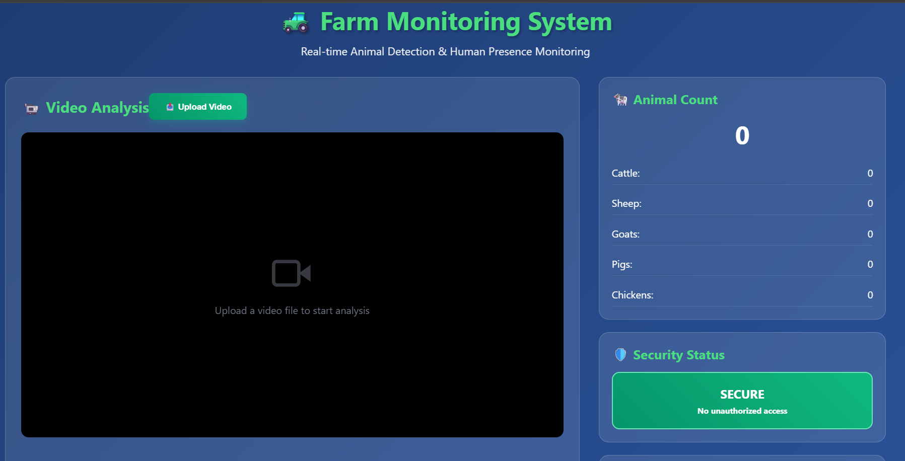

# Farm Monitoring System

A real-time farm monitoring dashboard that detects animals and human presence in uploaded video footage. The system features a modern React + Vite + Tailwind CSS frontend and a Flask backend for video upload and simulated detection.

---

## Features

- **Video Upload & Analysis:** Upload farm surveillance videos for analysis.
- **Real-time Detection:** Simulated detection of animals (cattle, sheep, goats, pigs, chickens) and human presence.
- **Live Dashboard:** View animal counts, security status, and recent detections.
- **Alert System:** Visual alerts when human presence is detected.
- **Modern UI:** Responsive, clean interface built with React and Tailwind CSS.

---

## Project Structure

```
├── app.py                  # Flask backend server
├── requirements.txt        # Python dependencies
├── package.json            # Frontend dependencies & scripts
├── src/                    # React frontend source code
│   ├── App.tsx
│   ├── main.tsx
│   ├── index.css
│   └── vite-env.d.ts
├── templates/
│   └── index.html          # Flask HTML template
├── uploads/                # Uploaded video files
├── index.html              # Frontend entry HTML
├── tailwind.config.js
├── postcss.config.js
├── vite.config.ts
├── tsconfig*.json
└── .gitignore
```

---

## Getting Started

### 1. Clone the Repository

```sh
git clone <your-repo-url>
cd <project-folder>
```

---

### 2. Backend Setup (Flask)

#### a. Install Python dependencies

```sh
pip install -r requirements.txt
```

#### b. Run the Flask server

```sh
python app.py
```

- The backend will be available at [http://localhost:5000](http://localhost:5000)
- Video uploads and analysis endpoints are handled here.

---

### 3. Frontend Setup (React + Vite)

#### a. Install Node.js dependencies

```sh
npm install
```

#### b. Start the development server

```sh
npm run dev
```

- The frontend will be available at [http://localhost:5173](http://localhost:5173)
- The React dashboard interacts with the Flask backend for video analysis.

---

## Usage

1. **Upload a Video:** Use the dashboard to upload a farm surveillance video.
2. **View Analysis:** The dashboard will display detected animals, human presence, and update stats in real-time.
3. **Monitor Alerts:** If a human is detected, an alert banner and security status will update accordingly.

---

## Customization

- **Detection Logic:** The backend currently simulates detections. Integrate real detection models in [`app.py`](app.py) as needed.
- **UI Enhancements:** Modify or extend the React components in [`src/App.tsx`](src/App.tsx) for more features or a different look.

---

## Scripts

- **Frontend**
  - `npm run dev` — Start development server
  - `npm run build` — Build for production
  - `npm run preview` — Preview production build
  - `npm run lint` — Lint code

- **Backend**
  - `python app.py` — Start Flask server

---

## Dependencies

- **Frontend:** React, Vite, Tailwind CSS, Lucide React Icons, TypeScript
- **Backend:** Flask, Werkzeug

---

## License

This project is for educational/demo purposes. Please adapt and use as needed.

---

## Screenshots



---

## Authors

- Sachin Dasture ([@DastureSachin](https://github.com/DastureSachin))

---

## Acknowledgements

- Inspired by modern farm monitoring and security